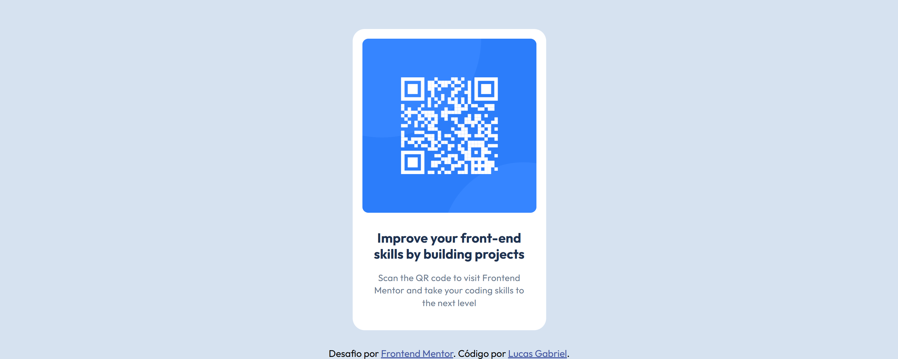
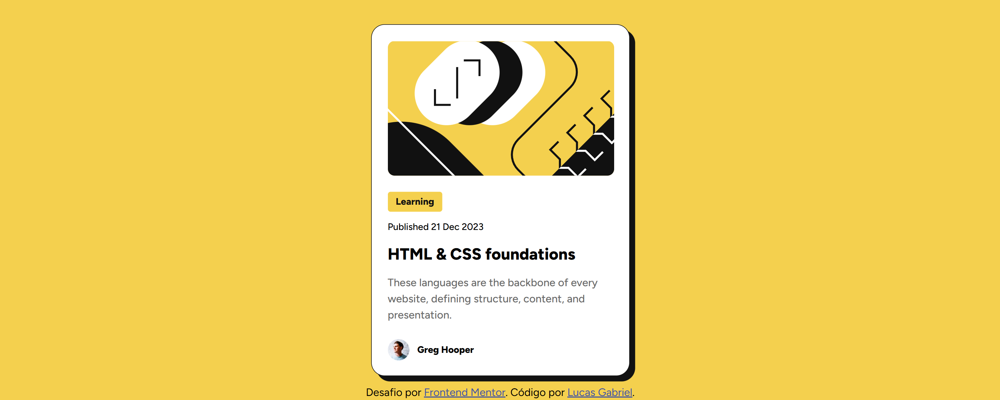
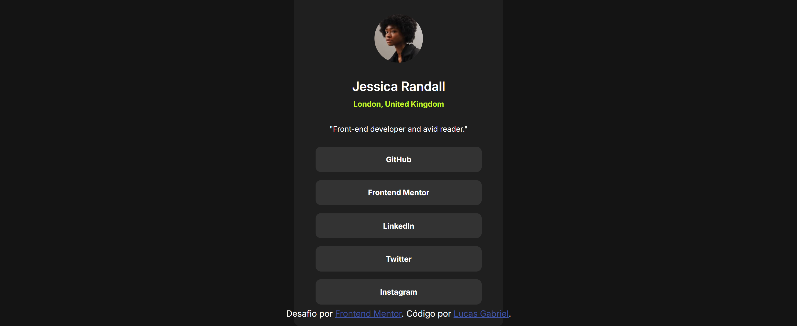

# Frontend Mentor - Desafios

Minhas resoluções dos desafios da plataforma Frontend Mentor.

Acesse o site: <a href="https://www.frontendmentor.io/" target="_blank">frontendmentor</a>

<a href="https://lucasgabriel2806.github.io/frontend-mentor/qr-code-component/" target="_blank">QR Code component</a>

<a href="https://lucasgabriel2806.github.io/frontend-mentor/blog-preview-card/" target="_blank">Blog preview card</a>

<a href="https://lucasgabriel2806.github.io/frontend-mentor/social-links-profile/" target="_blank">Social links profile</a>

  

## Tecnologias utilizadas
<table>

  <tr>
    <td width="50">
      
    </td>
    <td>
      HTML: Estrutura da página web
    </td>
  </tr>

  <tr>
    <td width="50">
      
    </td>
    <td>
      CSS: Estilização da página web
    </td>
  </tr>

</table>
